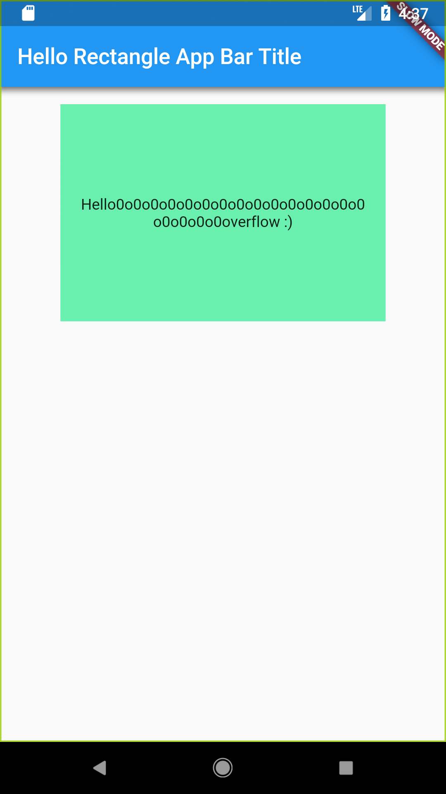
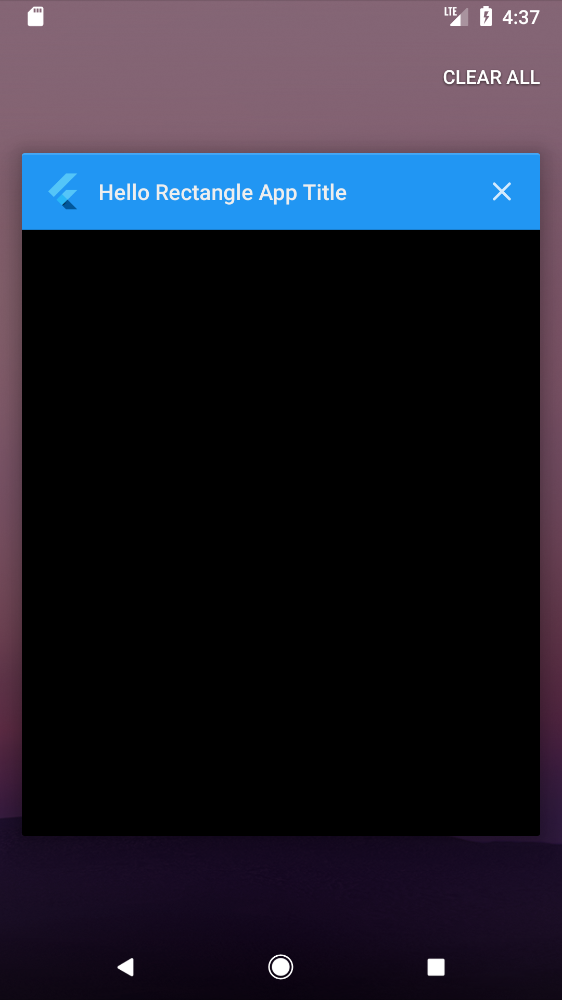

# Build a Hello Rectangle App

## Goals
 - Verify you've set up Android Studio.
 - Verify that the Flutter plugin has been installed.
 - Run an app!

## Steps
 1. Create an app. You can do this using `flutter create hello_rectangle` from the command line, or by going to File -> New -> New Flutter Project.
 2. Delete the contents of your app's `lib/main.dart`.
 3. Paste in the code from [lib/main.dart](lib/main.dart) into your app's `lib/main.dart`.
 4. Open your device or emulator, and build and launch the app. You can do all this using the green Play button in Android Studio. From the command line, you can also do `flutter run` inside your app's project directory.

## Specs
 - App has a title.
 - App Bar has a title.
 - Colored rectangle is centered in the app.
 - Text is centered in the Container widget, and center-aligned.

## Screenshots

