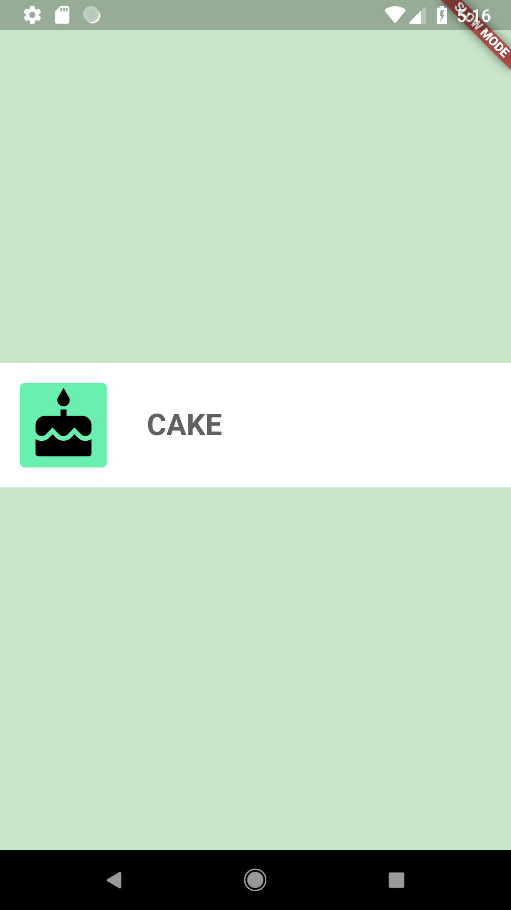
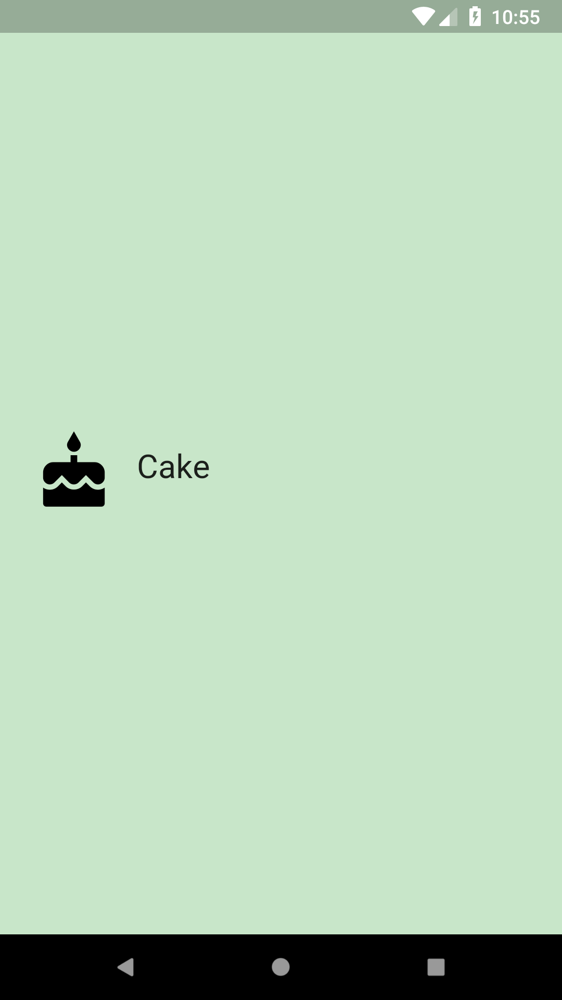
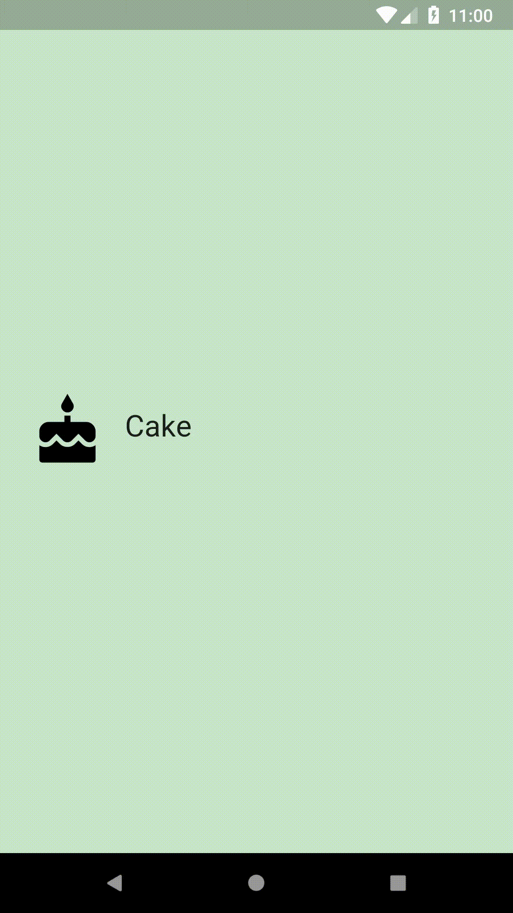

# Code a Custom Category Widget!

## Goals
 - Using the existing Flutter widgets, build a custom Category widget.
 - Customize the widget to your liking.

## Steps
 1. Fill out the TODOs in `category.dart` and `main.dart` using the specs below.
 2. Customize your Category widget if desired. Some ideas are listed below.

## Specs
 - The icon, color, and text should be passed into the Category widget upon instantiation. They should be required.
 - Height of the Category widget is 100.0. Its padding is 8.0.
 - The widget's border radius is half of the Category height (in this case, 50.0). You can define both the height and the border radius as constants.
 - Icon size is 60.0. The padding around the icon is 16.0.
 - Text size is 24.0.
 - The InkWell will not animate if the onTap function is null. Use a print statement for now, as a placeholder. i.e. ```onTap: () { print('I was tapped!'); }```
 - The InkWell's splash and highlight colors should be the color we pass in.

## Customizations
 - You can choose what icon, text, and color(s) to use.
 - You can customize the border radius.

## Screenshots

### Start


### Solution
 &nbsp; &nbsp; 
