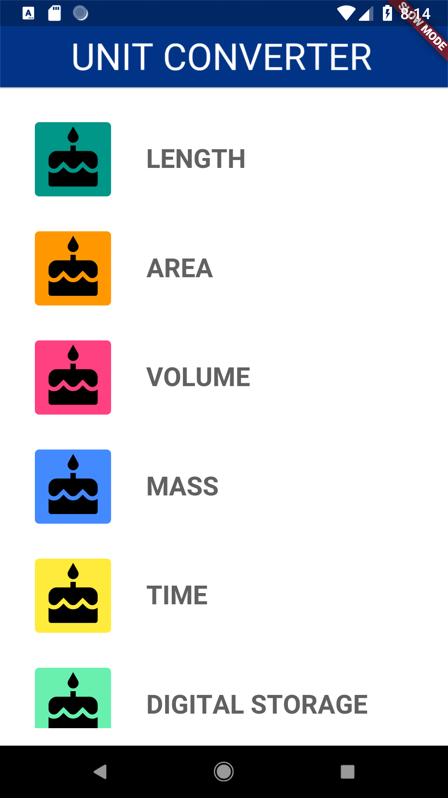

# task_03_category_route

Code the AppBar
Specs:
    - Color should be _appBarColor
    - Title should say 'Unit Converter' in uppercase

Code the Category Route
Specs:
    - A route that display 8 Category widgets, which fit on the screen without scrolling
    - Use the predefined list of Category names (Length, Mass, etc.) and colors

It should look like this:

