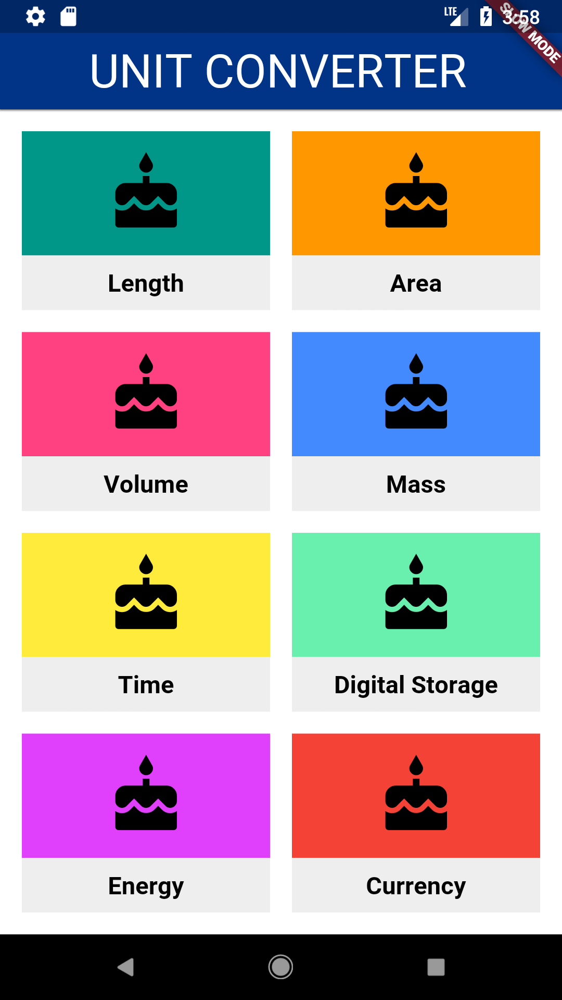
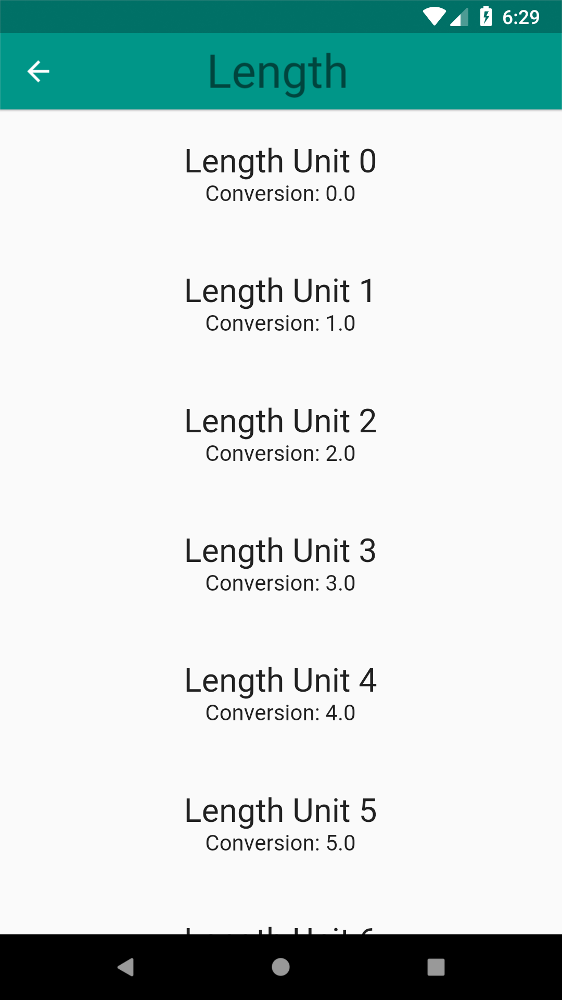
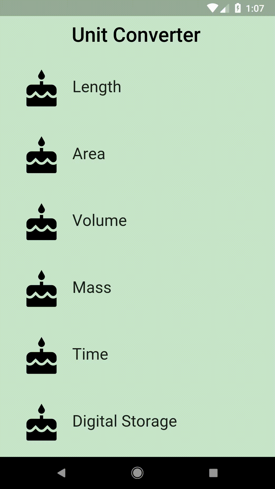

# Add Navigation!

## Goals
 - Create a unit converter screen. Currently, this screen just displays some mock units (which we've generated for you in `category_route.dart`, using the Unit class in `unit.dart`).
 - Navigate to a Category-specific route, when you tap on a Category. This route takes you to the unit converter screen.

## Steps
 1. Fill out the TODOs in `category.dart` and `converter_route.dart` using the specs below.
 2. Customize your app if desired.

## Specs
 - The ConverterRoute should also have an AppBar, the same color as the Category widget that was tapped.
 - The Title of the AppBar should be the name of the Category.
 - Pass the name, color, and units to the ConverterRoute.
 - The background color of each unit should be the same as the ConverterRoute's AppBar color.

## Screenshots

### Start

### Solution

