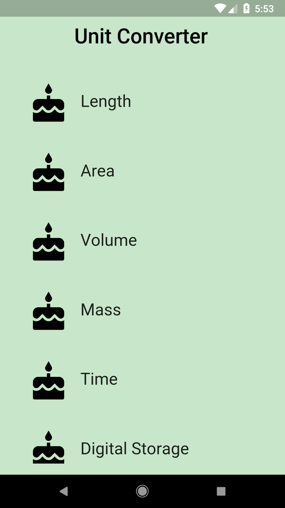
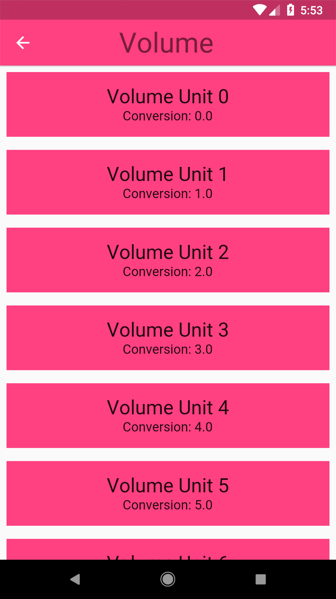

# Add Stateful Widgets!

## Goals
 - Make the CategoryRoute and ConverterRoute StatefulWidgets. Visually, nothing has changed.

## Steps
 1. Fill out the TODOs in `category_route.dart` and `converter_route.dart` using the specs below.

## Specs
 - CategoryRoute is a StatefulWidget.
 - ConverterRoute is a StatefulWidget.
 - Inside the CategoryRoute, the list of Categories is saved as part of the State.

## Screenshots

### Start and Solution (visually the same)
