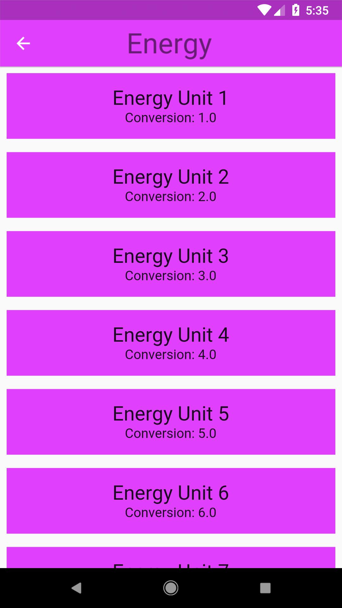
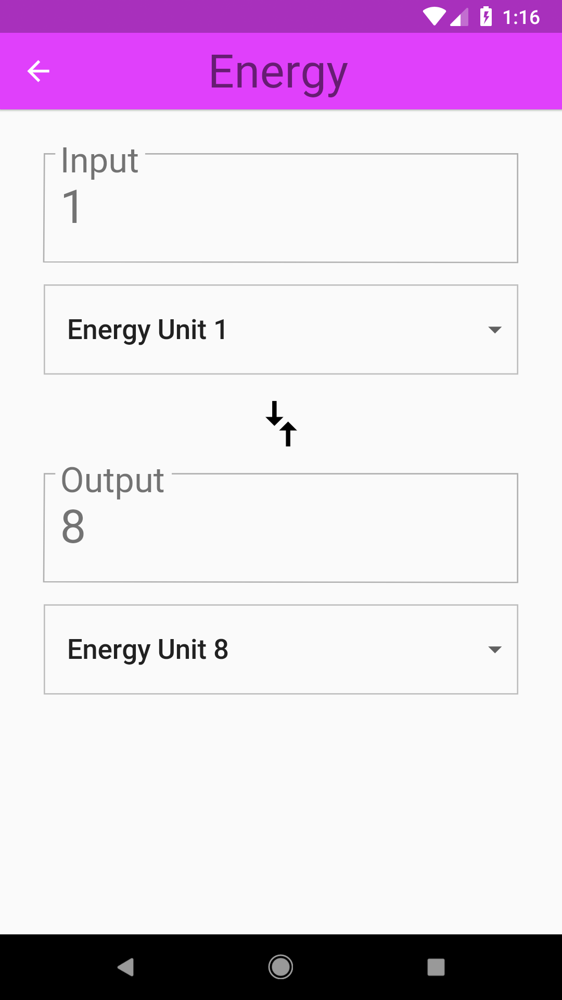
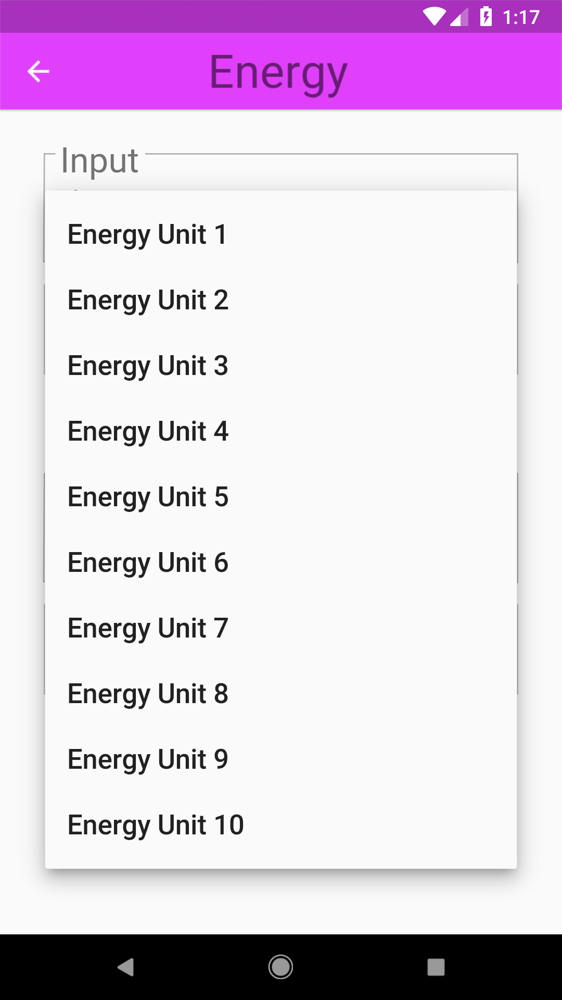

# Add User Input!

## Goals
- Add user input so that a user can convert an amount from one unit to another.

## Steps
 1. Fill out the TODOs in `converter_route.dart` using the specs below.
 2. Use the helper function provided to aid in the conversions. You'll likely have to add more. Remember to set the state!
 3. Update the Theme in `main.dart`, and the colors in `category.dart`.

## Specs
 - The 'input' group is composed of a TextField and a Dropdown for the 'From' unit. This group has a Padding of 16.0.
 - Users should only be able to enter numbers.
 - The input TextField should be styled with its label in the border (see screenshot). Hint: Use the OutlineInputBorder widget.
 - An error style with error text should show up when invalid values are entered.
 - The 'output' group is composed of an output Text with the conversion result, and a dropdown for the 'To' unit. It likewise has an overall Padding of 16.0.
 - The output text should also be wrapped inside a border.
 - Dropdowns have a vertical 8.0 Padding.
 - Add a 'Compare Arrows' icon between the dropdowns. This is the Material Icon named 'compare arrows'. The arrows are sized 40.0.
 - The entire user input section is wrapped in 16.0 Padding.
 - A Category's highlight and splash colors should be retrieved from its ColorSwatch.
 - Set the ThemeData's textTheme to have a body color of black, and a display color of Colors.grey[600].
 - The ThemeData's primaryColor should be Colors.grey[500].

## Customizations
 - Style the input/output boxes and dropdowns. Consider colors, border radius, padding, text themes, etc.

## Screenshots

### Start

### Solution

