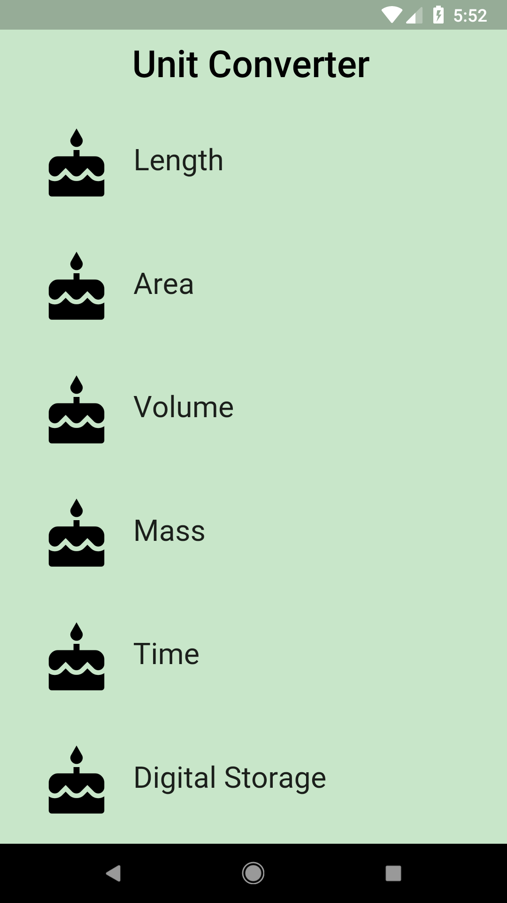
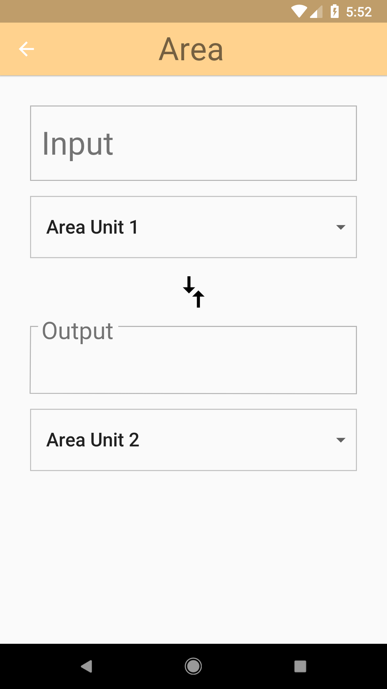
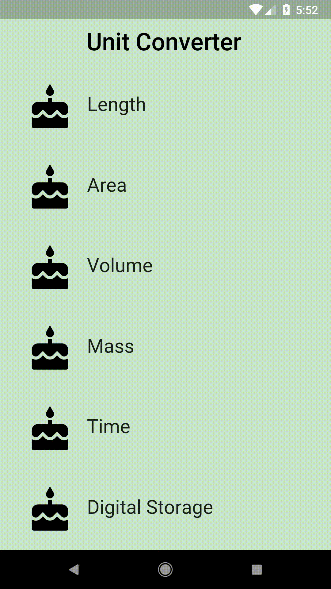
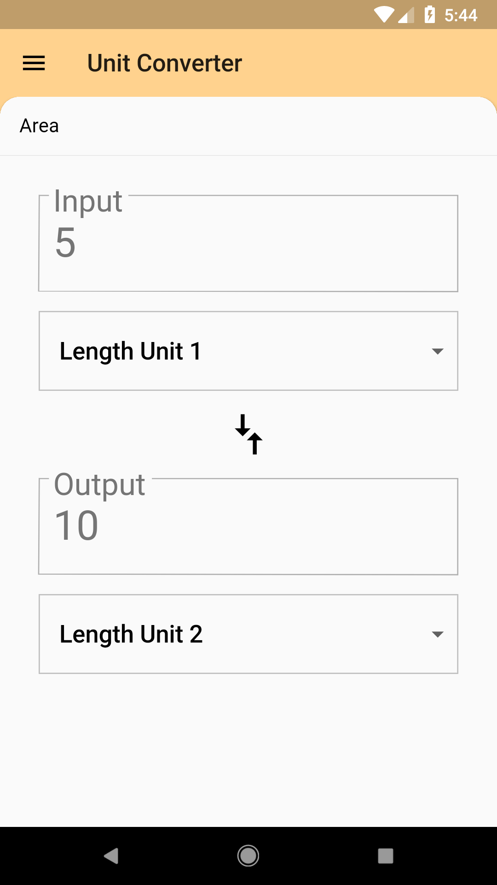
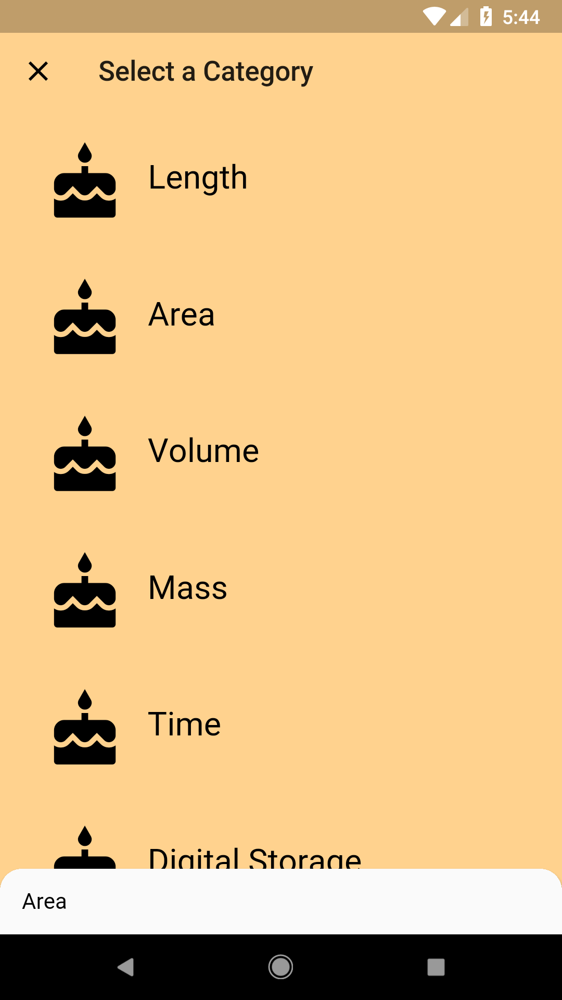
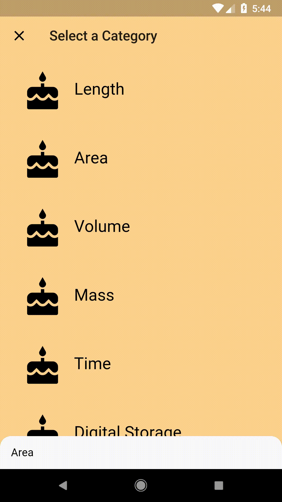

# Use a Backdrop!

## Goals
- Use a Backdrop widget to make navigation feel smoother.

## Steps
 1. Take a look at the provided Backdrop widget. You should pass in the objects and widgets needed in its constructor. Note that we've renamed the ConverterRoute to UnitConverter, since it is no longer a route, when using a Backdrop. For Category, we've also separated the logic between the data and the UI widget itself, into Category, and CategoryTile. The UnitConverter now takes in a Category in its constructor rather than a name, color, and icon.
 2. Fill out the TODOs in `category_route.dart`. Specifically, you'll be using the provided Backdrop widget.
 3. Fill out the TODOs in `category_tile.dart` using the specs below. You'll remove the Navigator code since the Backdrop is now responsible for showing and hiding the unit conversion view. The CategoryTile widget takes in an onTap function, and you should use it to bring up the unit conversion view.
 4. Update the Theme in `main.dart`.
 5. You may see some black and yellow overflow lines, accompanied by a message regarding RenderFlex. This is fine, as we'll resolve this in the next coding exercise.

## Specs
 - The default Category is 'Length'; when you open the app, the unit converter for 'Length' will already be showing.
 - The front panel should show the unit converter for the currently-selected Category. While the front panel is up, the text at the top of the app (title) should say 'Unit Converter'.
 - Tapping on the 'clear' icon in the top right corner should bring you to the list of Categories. When in this list, the text at the top of the app (title) should say 'Select a Category'.
 - The back panel color depends on the color from the Category.
 - The bottom padding for the back panel should be 48.0, to give it space for the bottom tab.
 - A Category's highlight and splash colors should be retrieved from its ColorSwatch.
 - Set the ThemeData's textTheme to have a body color of black, and a display color of Colors.grey[600].
 - The ThemeData's primaryColor should be Colors.grey[500].
 - If a user types in an input value, the value should not be cleared when the user closes and re-opens the front panel.

## Customizations
- Feel free to dig through the Backdrop widget code.
- Change the colors and theme.

## Screenshots

### Start

### Solution
