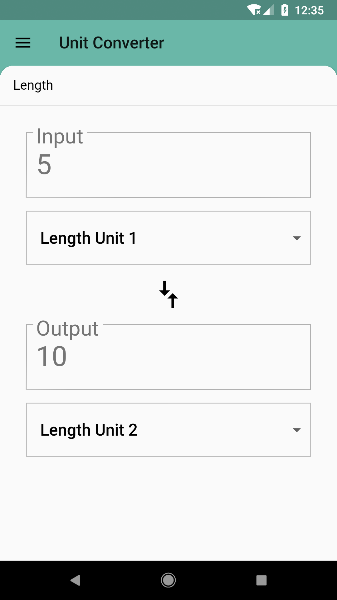
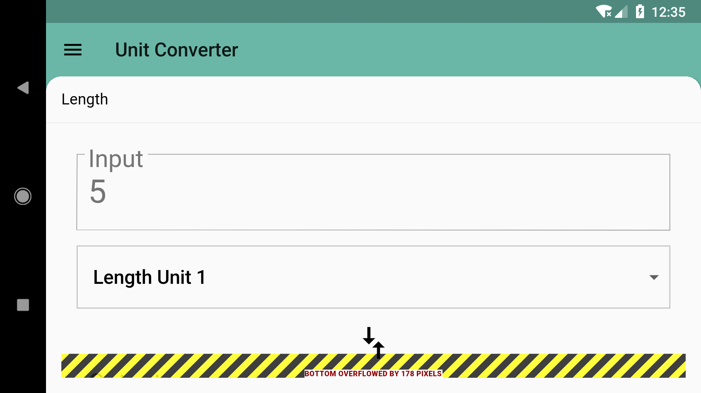
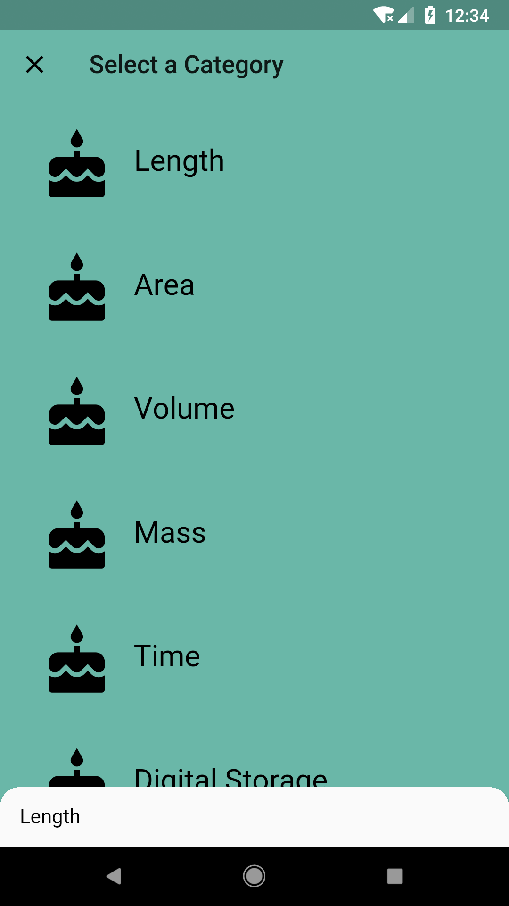
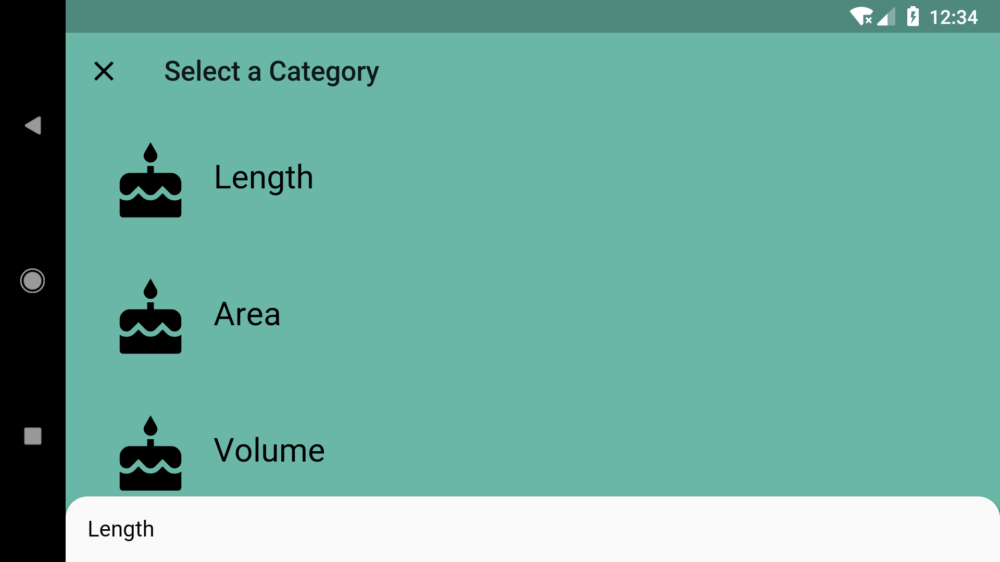
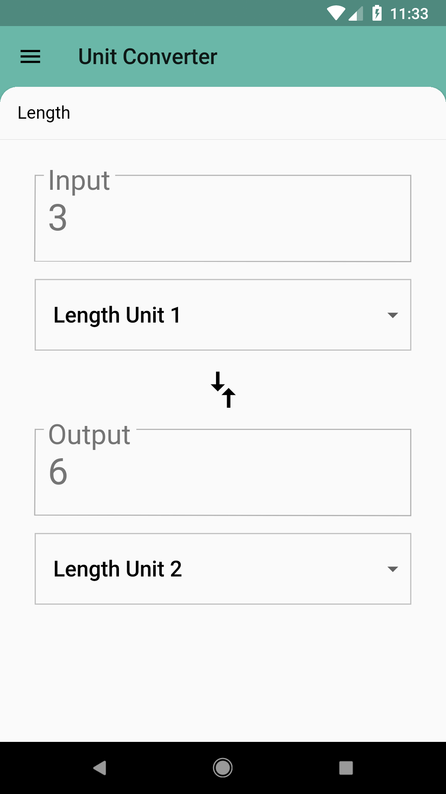
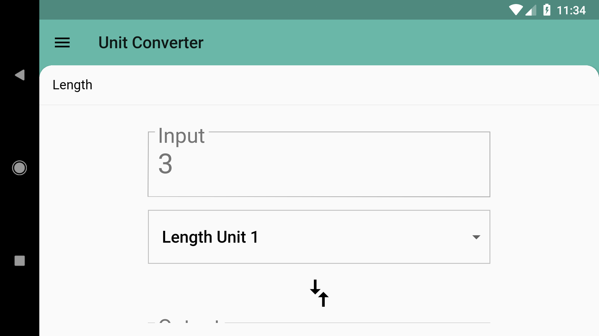
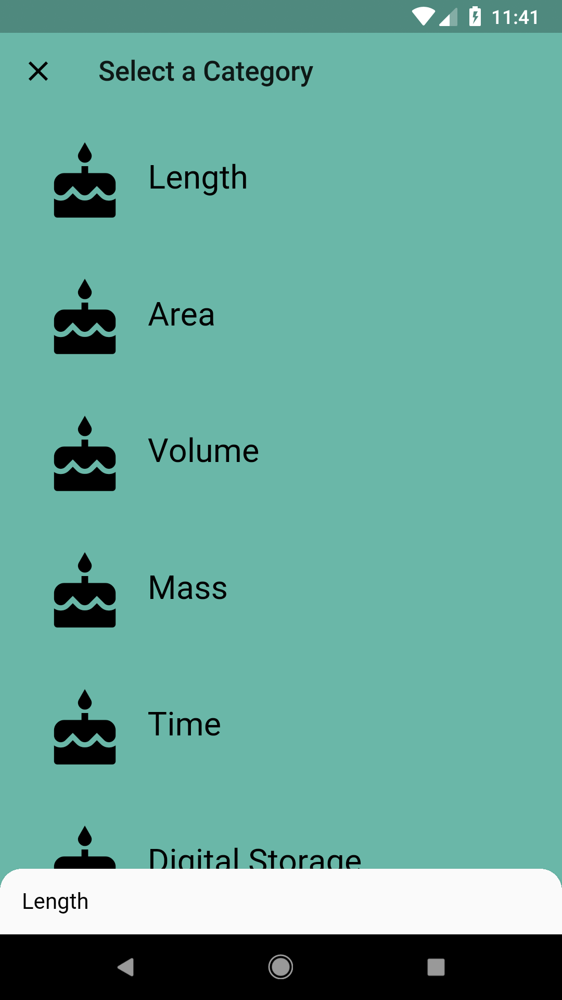
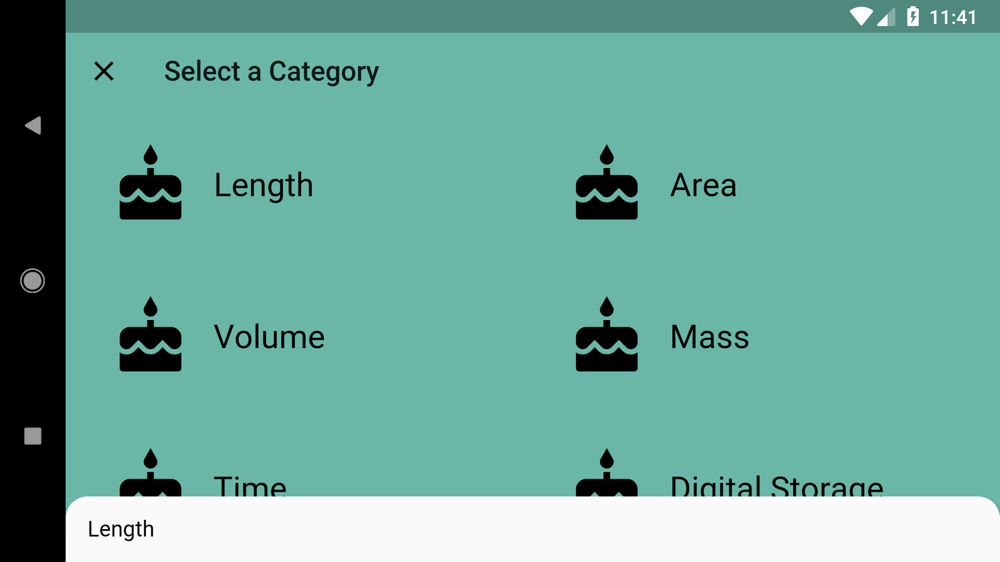

# Add Responsive Design!

## Goals
- Remove RenderFlex exceptions.
- Ensure the app is usable in both portrait and landscape mode, and for devices of different sizes.

## Steps
 1. Fill out the TODOs in `category_route.dart` and `unit_converter.dart` using the specs below.

## Specs
 - Using MediaQuery, display a GridView for the list of Categories in CategoryRoute. The GridView should have two items per row and have an aspect ratio of 3.0.
 - Use a ListView instead of a Column to draw your UnitConverter. This ensures that your converter is viewable on all screens, and is scrollable when the screen is too small to fit it all. This also removes the RenderFlex exception while the front panel of the Backdrop is being opened and closed (alternatively, you could use a SingleChildScrollView).
 - Using OrientationBuilder, display the unit converter at 450.0 width, centered, in landscape mode. Display it at full size in portrait mode.
 - When you switch from portrait to landscape mode, if a user already has entered a value, it should remain in the input TextField.

## Customizations
 - If you want your landscape view to not require as much scrolling, you can reorganize the input and output groups into a "Row"-style ListView that scrolls horizontally instead of vertically.

## Screenshots

### Start

### Solution

