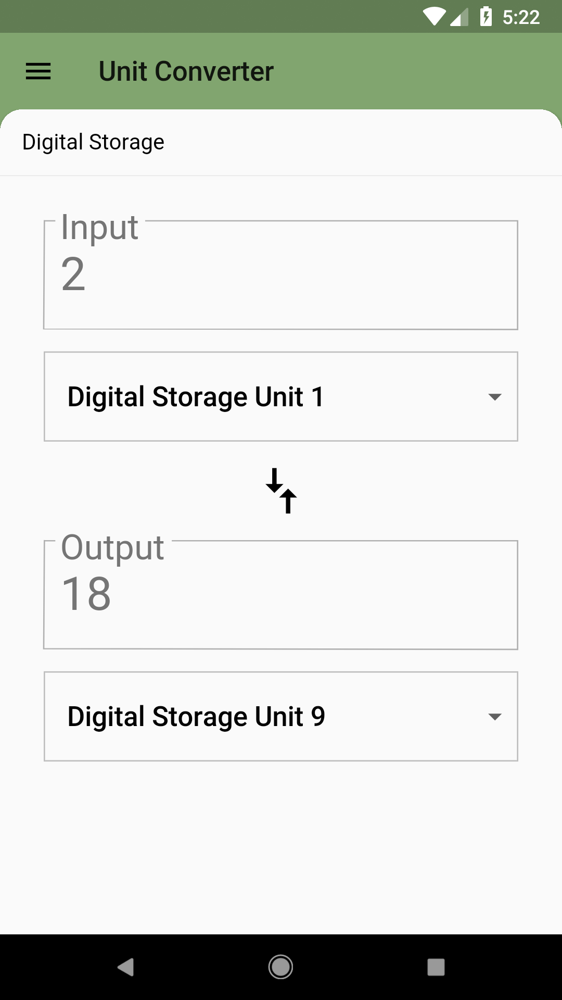
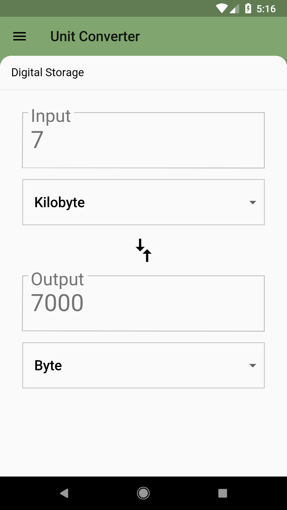

# Add Real Units!

## Goals
- Use real unit conversions, provided by a JSON file asset.

## Steps
 1. Take a look at the way each Category's units are set up in `assets/data`.
 2. Fill out the TODOs in `pubspec.yaml` and `category_route.dart` using the specs below.

## Specs
 - The unit converter should now pull in units for each Category from a JSON file in the `assets/data` directory.

## Customizations
 - You can choose to use the regular or goofy units.
 - You can use Streams to retrieve the JSON data. We use the JsonDecoder.

## Screenshots

### Start

### Solution

