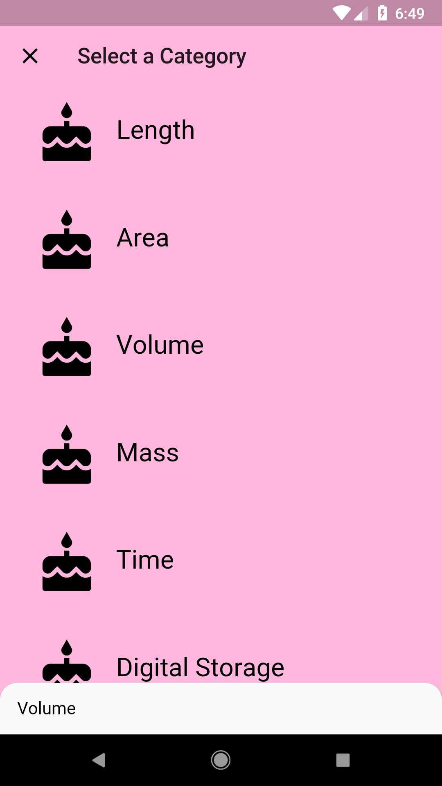
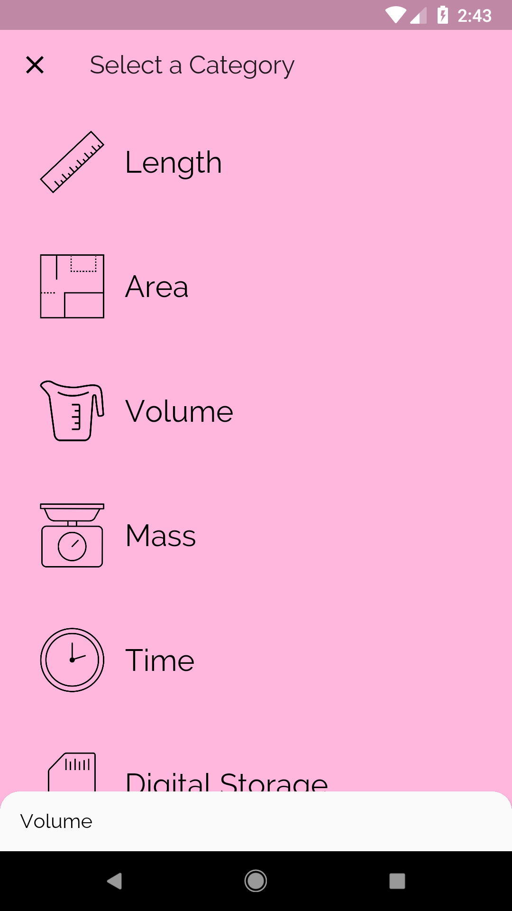

# Add Custom Icons and Fonts!

## Goals
- Personalize the app by adding custom icons and font(s).

## Steps
 1. We've added a set of icon images in the assets directory. Add these to the `pubspec.yaml`.
 2. Pick a font for the app. We've included Raleway in the assets. Add this to the `pubspec.yaml`.
 3. Fill out the TODOs in `category_route.dart`, `main.dart`, `category.dart`, and `category_tile.dart` using the specs below.

## Specs
 - The placeholder icons are now replaced with the icon images from our `assets/icons`.
 - The entire app uses Raleway.

## Customizations
 - Feel free to use a different font. You can check out fonts.google.com.
## Screenshots

### Start

### Solution

