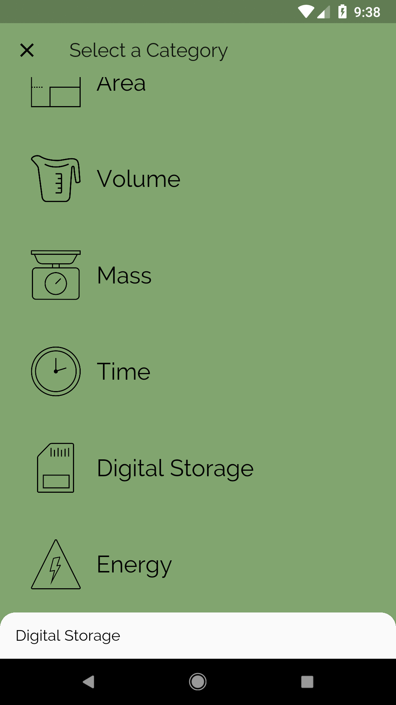
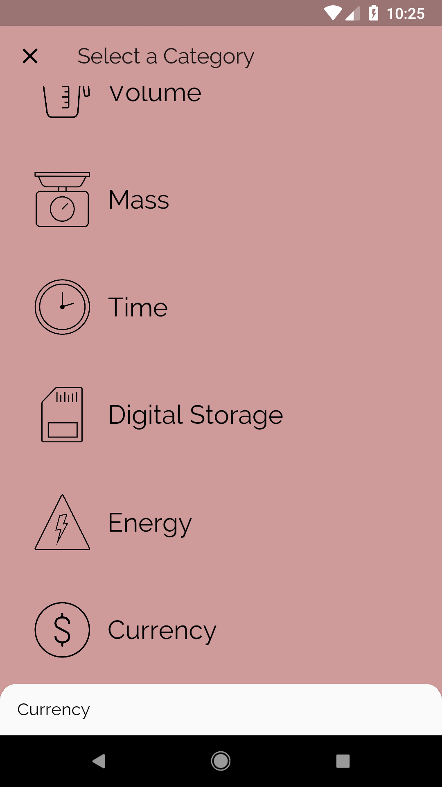
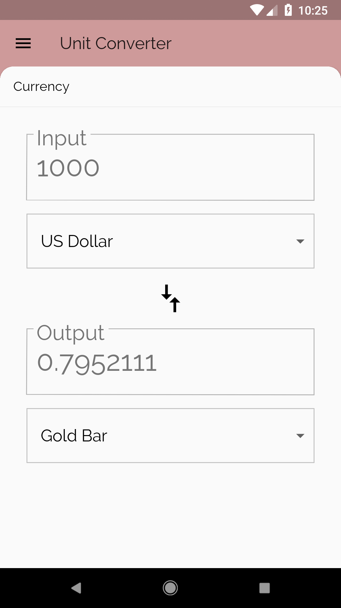
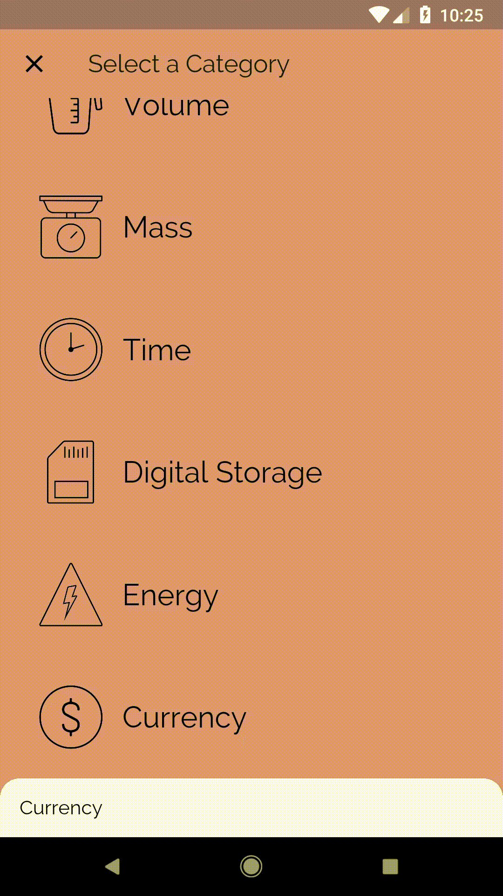

# Include Real-Time Units!

## Goals
- Incorporate real-time unit conversions, provided by an API.

## Steps
 1. Play around with the API at `flutter.udacity.com`, with some query parameters for `from`, `to`, and `amount`.
 2. Fill out the TODOs in `api.dart`, `category_route.dart` and `unit_converter.dart` using the specs below.

## Specs
 - Our Api class should expose two functions: getUnits() and convert().
 - getUnits() retrieves a list of units for a given Category. Our only Category that uses an API is Currency, i.e. `flutter.udacity.com/currency`. This is used in CategoryRoute to load a list of Categories.
 - convert() takes in a `from` Unit, a `to` Unit, and a numerical `amount` to convert. An example is `https://flutter.udacity.com/currency/convert?from=US Dollar&to=Gold Bar&amount=500.0`. This is used in UnitConverter to convert Currency values.
 - On any errors, exceptions, or nulls, print a message and return `null`.

## Customizations
 - Feel free to point to a real Currency API, or to any other API.
 - Include more descriptive error messages.

## Screenshots

### Start

### Solution

