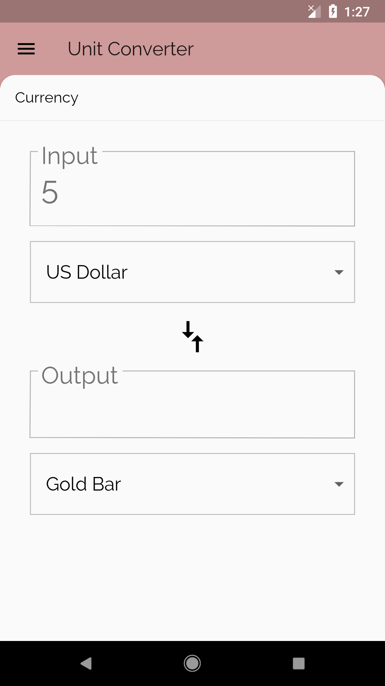
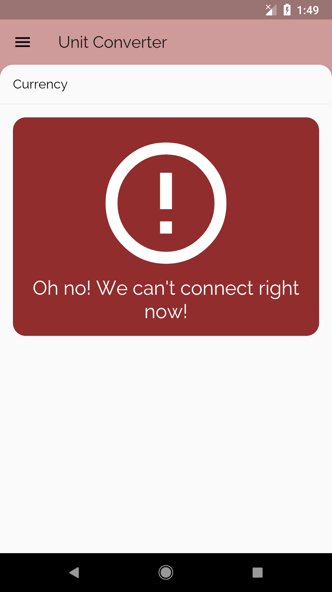
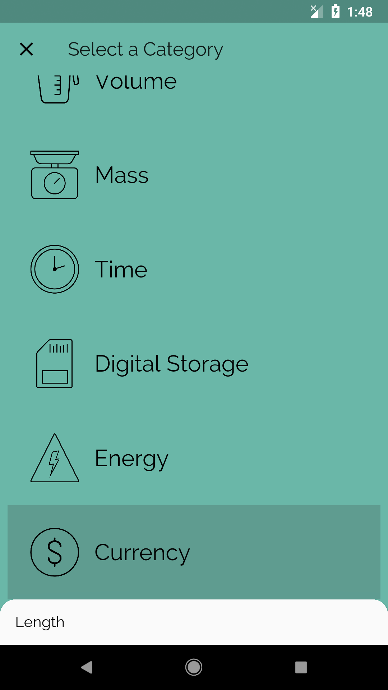

# Add Error Handling UI!

## Goals
- Show error UI when the API can't be reached.

## Steps
 1. Fill out the TODOs in `unit_converter.dart`,`category_route.dart`, and `category_tile.dart` using the specs below.
 2. It's time to celebrate, because you're done.

## Specs
 - When the device is not connected to the internet (e.g. if using an emulator, turn off the Wi-Fi), and the user is viewing the Currency UnitConverter, show an error UI when they type in a number.
 - Even though the unit converter doesn't work for the Currency category when there is no Wi-Fi, it should still work for the other Categories.
 - When the device is not connected to the internet and the user is in the Category list view, tapping on the Currency CategoryTile should not take them to the UnitConverter.

## Customizations
 - Customize the error UI.
 - Add error UI for other error cases. For instance, tapping on the CategoryTile can show an error message or error UI. Or, it can show some disabled UI (e.g. grey text).

## Screenshots

### Start

### Solution

